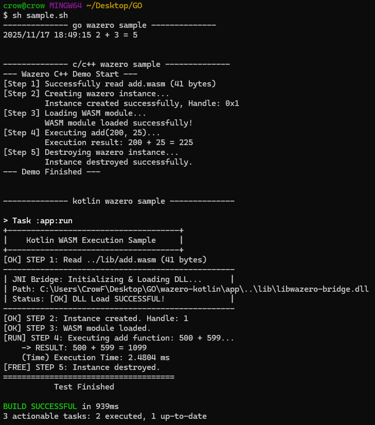

# 🌉 Wazero JNI Bridge

# ⚠️ Compatibility Notice: Kotlin/Wasm & WasmGC
> Since Kotlin 1.9.20, the Kotlin toolchain uses the latest WebAssembly Garbage Collection (WasmGC) proposal by default. As stated in the official documentation: "For this reason, we strongly recommend that you update your Wasm projects to the latest version of Kotlin. We also recommend you use the latest versions of browsers with the Wasm environment." However, the wazero runtime (used in this project) does not yet support the WasmGC proposal.  Consequently, Wasm binaries generated by the current Kotlin/Wasm compiler are incompatible with this bridge. To use this project, you must currently use other toolchains (such as TinyGo, Rust, or C++) that generate standard Wasm MVP binaries, or wait for wazero to implement WasmGC support.

**This project demonstrates how to call a Go WebAssembly runtime ([wazero](https://github.com/wazero/wazero)) from a Kotlin/JVM application. The connection is made possible by a lightweight C++ bridge using the Java Native Interface (JNI).**

**The complete call chain is: Kotlin (JVM) $\rightarrow$ JNI $\rightarrow$ C++ $\rightarrow$ Go (Static Library)**

***

## 📋 Prerequisites

**Before you begin, ensure you have the following tools installed and configured in your system's PATH.**

| Tool | Requirement |
| :--- | :--- |
| **Go** | **Go programming language compiler and tools.** |
| **CMake** | ****A cross-platform build system generator.** |
| **MinGW-w64**| **A C/C++ compiler toolchain for Windows (GCC/G++).** |
| **JDK** | **Java Development Kit (version 11 or higher recommended for JNI).** |
| **wabt** | **The WebAssembly Binary Toolkit, for compiling `.wat` to `.wasm`.** |

***

## 🏗️ Build Process (Step-by-Step)

**Follow these steps in order to build the entire project from source.**

### 1. Compile the Go Library (Go $\rightarrow$ C Archive)

**Compile the Go source code into a static C archive (`.a`) that can be linked with our C++ bridge.**

| Command | Description |
| :--- | :--- |
| `go build -buildmode=c-archive -o libwazerocore.a go-library/core.go` | Builds the Go code into `libwazerocore.a` and generates a C header file `libwazerocore.h`. |

### 2. Compile WebAssembly (WAT $\rightarrow$ WASM)

This step is only necessary if you modify the `.wat` (WebAssembly Text) source file. It requires the `wabt` toolchain.

| Command | Description |
| :--- | :--- |
| `wat2wasm wasm/add.wat -o wasm/add.wasm` | **Compiles the text format to the binary format required by the runtime.** |

### 3. Build the C++ JNI Bridge (C++ $\rightarrow$ DLL)

**This step uses CMake to compile the C++ wrapper code (`bridge.cpp`) and link it against the Go archive, producing a native shared library (`.dll`) that the JVM can load.**

```shell
# Navigate to the C++ bridge project directory
cd wazero-bride-c

# Run the configure script to generate build files
./configure.sh

# Run the build script to compile the DLL and the sample EXE
./build.sh
```
After this step, `wazero-bride-c/build/` will contain `libwazero-bridge.dll` and `sample.exe`.

### 4. Build and Run the Kotlin Application (Kotlin $\rightarrow$ JVM)

**Finally, build and run the Kotlin application. The Gradle script is configured to load the DLL produced in the previous step and execute the demo.**

```shell
# Navigate to the Kotlin project directory
cd wazero-kotlin

# Use the Gradle wrapper to run the application
./gradlew app:run
```

***

## 🚀 Quick Commands

**For convenience, you can use the provided shell scripts to automate the build and run process.**

| Action | Command | Description |
| :--- | :--- | :--- |
| **Build All** | `sh build.sh` | **Cleans and builds the entire project chain: Go library, C++ DLL, and Kotlin app.** |
| **Run Kotlin App**| `sh sample.sh` | **Executes the final Kotlin application, assuming all artifacts are already built.** |

***

## 📸 Sample Result
**A screenshot of the successful execution of the sample application, demonstrating the output from Go, C, and Kotlin.**



---

## 🙏 Acknowledgements

*   **This project relies on the excellent [wazero](https://github.com/wazero/wazero) library, the only dependency-free WebAssembly runtime for Go.**
*   **Special thanks to [Jesse Wilson (swankjesse)](https://github.com/swankjesse) and [Jake Wharton](https://github.com/JakeWharton), the ideas that inspired this JNI bridge approach, and their contributions to the [Zipline](https://github.com/cashapp/zipline) project.**